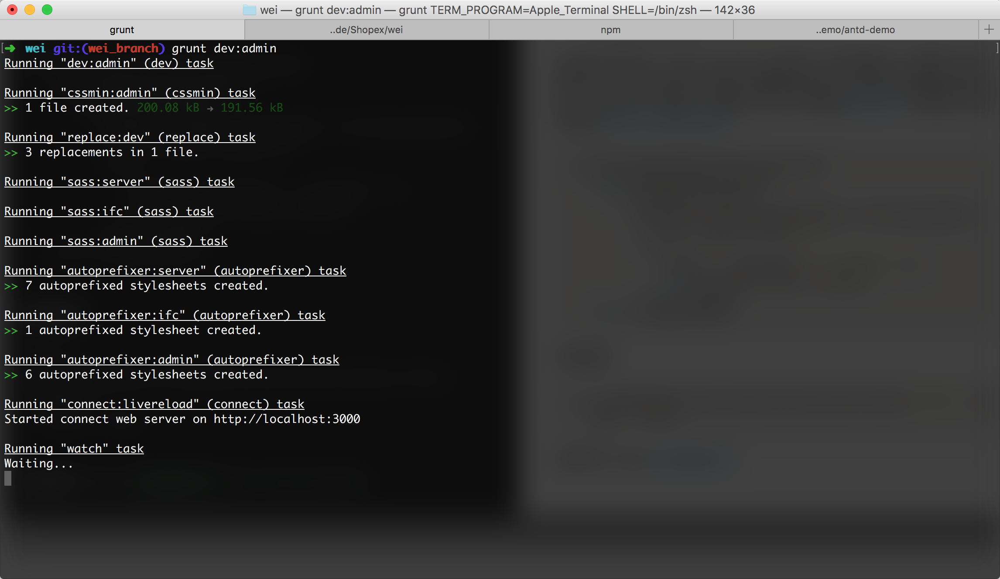
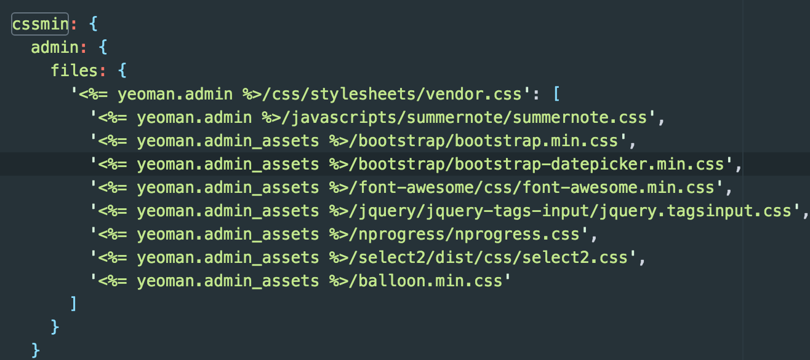
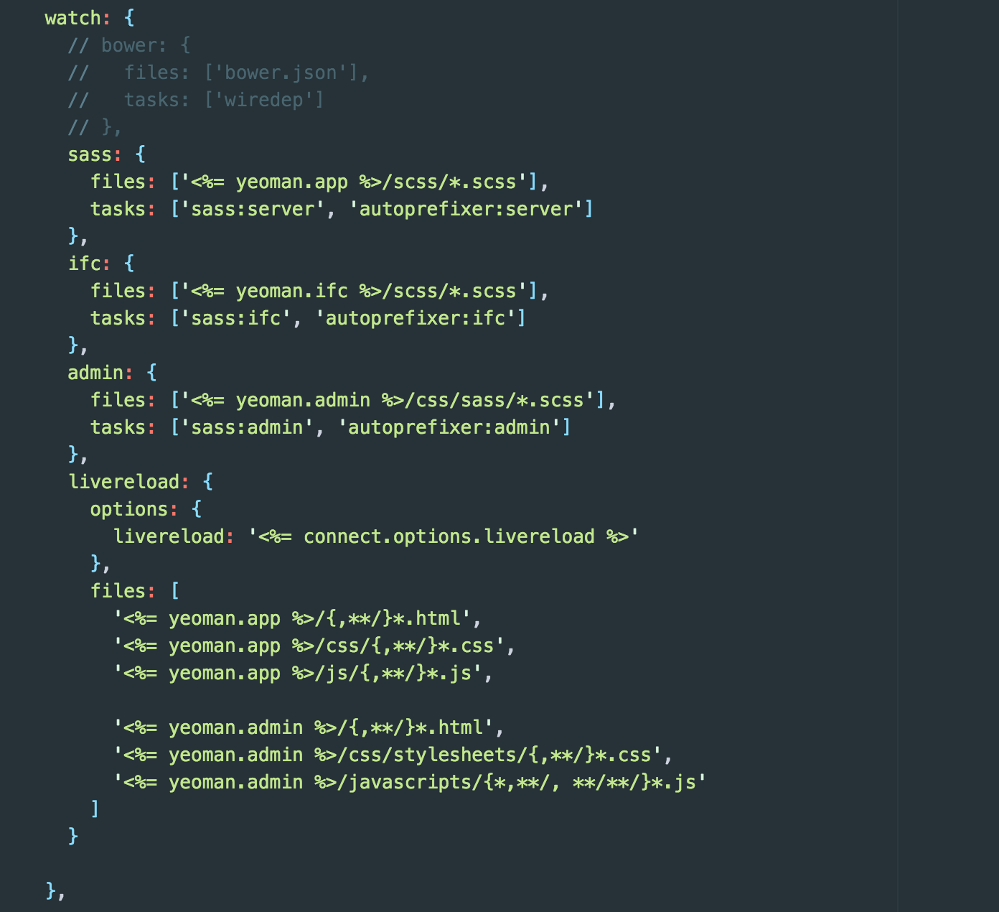
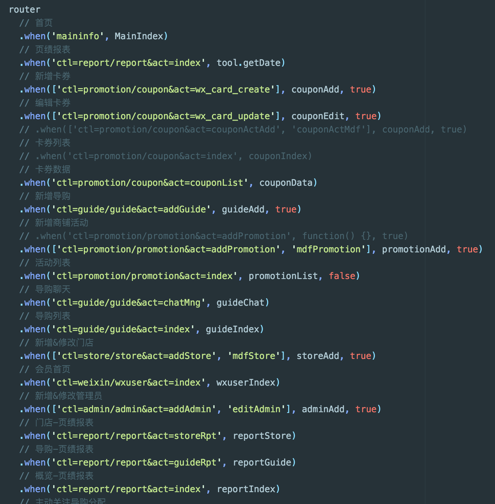
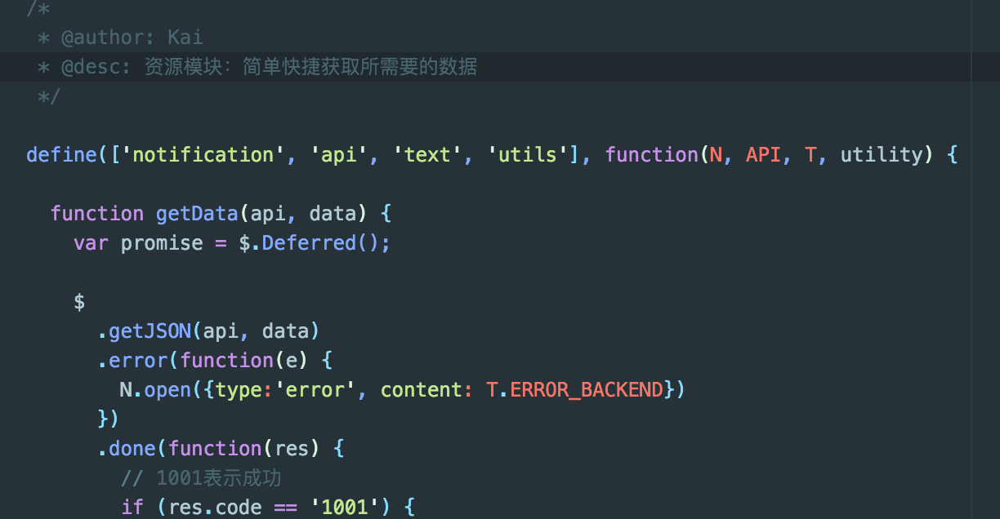
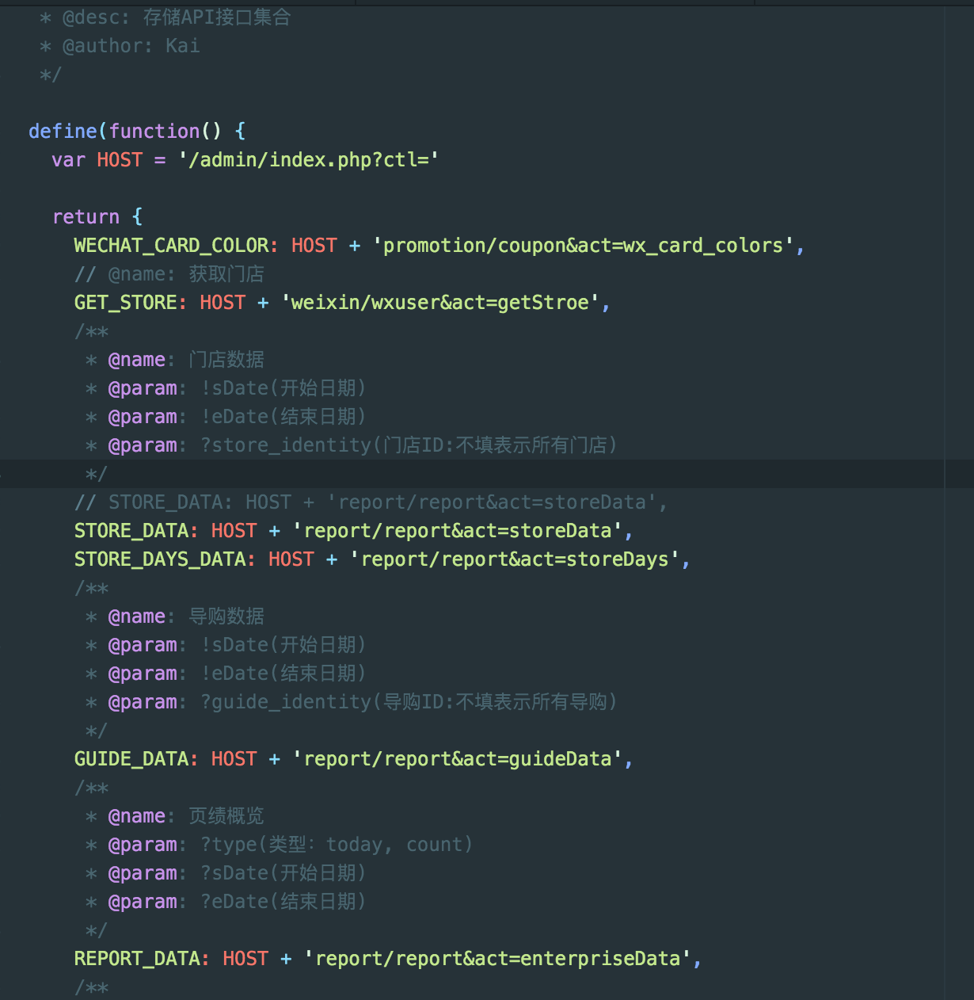
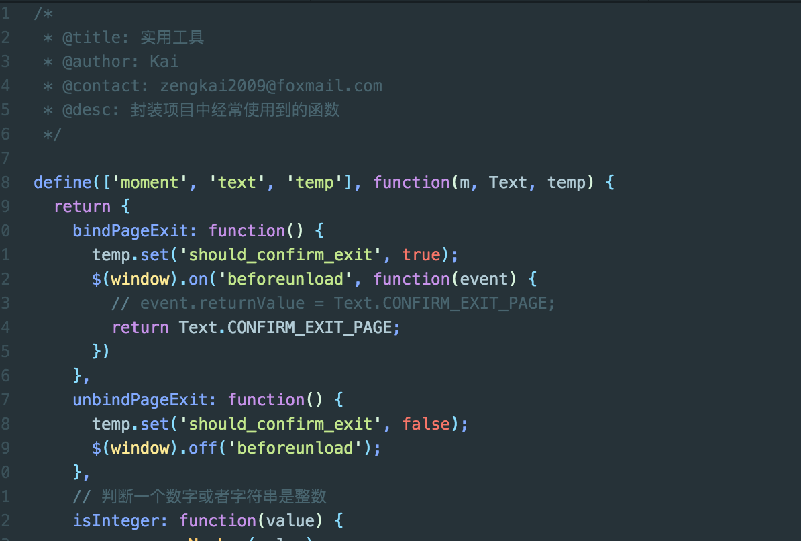

# 朋客商户端前端说明文档

### 开发
```javascript
grunt dev:admin
```



#### 启动的任务

* `cssmin`：admin将使用到的CSS文件打包成一个单独的vendor.css，便于节省页面打开时间

* `replace:dev`：替换`index.html`文件中的代码进入开发模式（启动livereload，JS文件无缓存）
* `sass`：将`sass`文件编译打包成单独的文件`main.css`
* `autoprefixer`：添加浏览器厂商前缀
* `connect:livereload`:修改文件后立即刷新
* `watch`：监听文件变化



### 打包
```javascript
grunt build:admin
```

* `requirejs`：将`requirejs`组件打包成一个文件

### 架构

主入口是位于`admin/view/javascripts`目录下的`app.js`文件，里面存放有`requirejs`的配置文件，以及调用一些内置的模块，比如路由模块和`PJAX`模块。

该项目采用`jquery pjax`实现单页面应用，点击不同链接将自动拉取`admin/view`下面的`html`片段文件，同时如果路由模块匹配地址成功，则会调用该页面所属的控制器。


路由模块`when`方法提供三个参数，第一个参数代表匹配的路径，可选`String`和`Array`类型，第二个参数表示匹配成功后加载的控制器，第三个参数代表是否在离开时进行确认，一般使用在表单填写的页面上，默认为`false`。

#### 模块列表

#### Resource

存储一些获取来自服务器数据的方法，主要使用到`jquery`中的`Ajax`, `Deferred`对象。



##### API

API集合模块，存储项目中使用到的API地址



#### Utils

实用工具集，遵循DRY(Don't Repeat Yourself)原则，把项目中一些常用的方法封装成单独的一个模块。


#### Chart（图表）

表格组件，内部调用`EChart`插件，对其进行进一步的封装，主要在业绩报表中使用。


