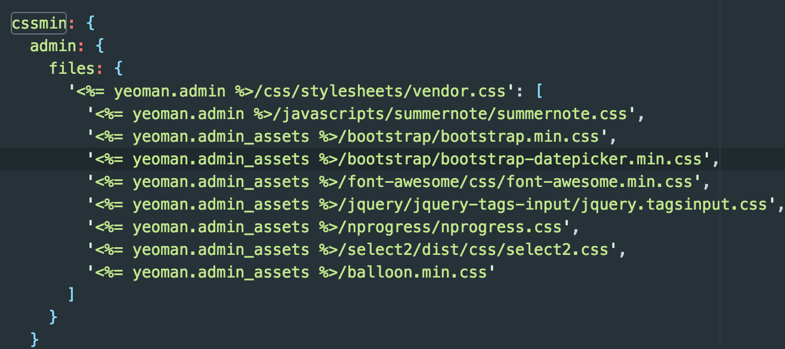

# 朋客商户端前端说明文档

### 开发
```javascript
grunt dev:admin
```


#### 启动的任务

cssmin:admin

将使用到的CSS文件打包成一个单独的vendor.css，便于节省页面打开时间


replace:dev

sass

autoprefixer

connect:livereload

watch


### 打包
```javascript
grunt build:admin
```

